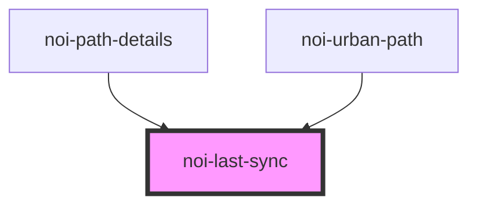

<!--
SPDX-FileCopyrightText: NOI Techpark <digital@noi.bz.it>

SPDX-License-Identifier: CC0-1.0
-->

# noi-last-sync

<!-- Auto Generated Below -->

## Properties

| Property                | Attribute | Description | Type   | Default     |
| ----------------------- | --------- | ----------- | ------ | ----------- |
| `syncDate` _(required)_ | --        |             | `Date` | `undefined` |

## Dependencies

### Used by

 - [noi-path-details](../path-details)
 - [noi-urban-path](../urban-path)

### Graph

----------------------------------------------

*Built with [StencilJS](https://stenciljs.com/)*
