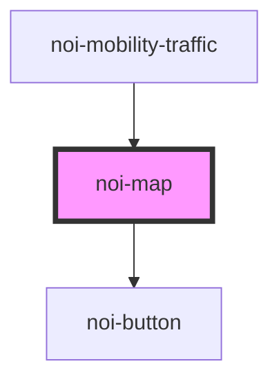

<!--
SPDX-FileCopyrightText: NOI Techpark <digital@noi.bz.it>

SPDX-License-Identifier: CC0-1.0
-->

# noi-mobility-map

<!-- Auto Generated Below -->

## Properties

| Property | Attribute | Description | Type     | Default   |
| -------- | --------- | ----------- | -------- | --------- |
| `lat`    | `lat`     |             | `number` | `46.4983` |
| `long`   | `long`    |             | `number` | `11.3548` |
| `scale`  | `scale`   |             | `number` | `13`      |

## Dependencies

### Used by

 - [noi-mobility-traffic](../..)

### Depends on

- [noi-button](../../components/button)

### Graph

----------------------------------------------

*Built with [StencilJS](https://stenciljs.com/)*
