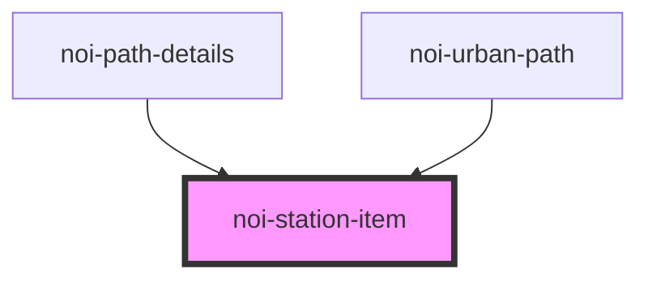

# noi-station-item

<!-- Auto Generated Below -->

## Properties

| Property                | Attribute  | Description | Type      | Default     |
| ----------------------- | ---------- | ----------- | --------- | ----------- |
| `isEnd`                 | `is-end`   |             | `boolean` | `false`     |
| `isStart`               | `is-start` |             | `boolean` | `false`     |
| `name` _(required)_     | `name`     |             | `string`  | `undefined` |
| `position` _(required)_ | `position` |             | `number`  | `undefined` |
| `time`                  | `time`     |             | `number`  | `undefined` |

## Dependencies

### Used by

 - [noi-path-details](../path-details)
 - [noi-urban-path](../urban-path)

### Graph

----------------------------------------------

*Built with [StencilJS](https://stenciljs.com/)*
