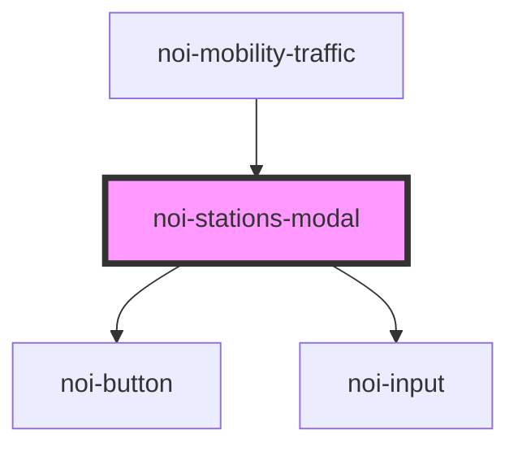

<!--
SPDX-FileCopyrightText: NOI Techpark <digital@noi.bz.it>

SPDX-License-Identifier: CC0-1.0
-->

# noi-stations-modal

<!-- Auto Generated Below -->

## Properties

| Property       | Attribute       | Description | Type               | Default   |
| -------------- | --------------- | ----------- | ------------------ | --------- |
| `overlayIndex` | `overlay-index` |             | `number`           | `1`       |
| `selecting`    | `selecting`     |             | `"end" \| "start"` | `'start'` |
| `visible`      | `visible`       |             | `boolean`          | `false`   |

## Events

| Event        | Description | Type                                  |
| ------------ | ----------- | ------------------------------------- |
| `modalClose` |             | `CustomEvent<{ stationId: string; }>` |

## Dependencies

### Used by

 - [noi-mobility-traffic](../..)

### Depends on

- [noi-button](../../components/button)
- [noi-input](../../components/input)

### Graph

----------------------------------------------

*Built with [StencilJS](https://stenciljs.com/)*
