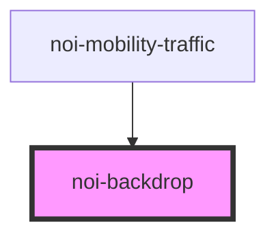

<!--
SPDX-FileCopyrightText: NOI Techpark <digital@noi.bz.it>

SPDX-License-Identifier: CC0-1.0
-->

# noi-backdrop

<!-- Auto Generated Below -->

## Properties

| Property          | Attribute          | Description | Type      | Default |
| ----------------- | ------------------ | ----------- | --------- | ------- |
| `overlayIndex`    | `overlay-index`    |             | `number`  | `1`     |
| `stopPropagation` | `stop-propagation` |             | `boolean` | `true`  |
| `tappable`        | `tappable`         |             | `boolean` | `true`  |
| `visible`         | `visible`          |             | `boolean` | `true`  |

## Events

| Event            | Description | Type                |
| ---------------- | ----------- | ------------------- |
| `noiBackdropTap` |             | `CustomEvent<void>` |

## Dependencies

### Used by

 - [noi-mobility-traffic](../..)

### Graph

----------------------------------------------

*Built with [StencilJS](https://stenciljs.com/)*
