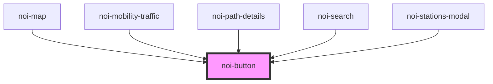

<!--
SPDX-FileCopyrightText: NOI Techpark <digital@noi.bz.it>

SPDX-License-Identifier: CC0-1.0
-->

# noi-button

<!-- Auto Generated Below -->

## Properties

| Property   | Attribute  | Description                                                                                                                                                                                                                                                                               | Type                                           | Default     |
| ---------- | ---------- | ----------------------------------------------------------------------------------------------------------------------------------------------------------------------------------------------------------------------------------------------------------------------------------------- | ---------------------------------------------- | ----------- |
| `disabled` | `disabled` | If `true`, the user cannot interact with the button.                                                                                                                                                                                                                                      | `boolean`                                      | `false`     |
| `download` | `download` | This attribute instructs browsers to download a URL instead of navigating to it, so the user will be prompted to save it as a local file. If the attribute has a value, it is used as the pre-filled file name in the Save prompt (the user can still change the file name if they want). | `string`                                       | `undefined` |
| `expand`   | `expand`   | Set to `"block"` for a full-width button or to `"full"` for a full-width button without left and right borders.                                                                                                                                                                           | `"block" \| "full"`                            | `undefined` |
| `fill`     | `fill`     | Set to `"clear"` for a transparent button, to `"outline"` for a transparent button with a border, or to `"solid"`. The default style is `"solid"` except inside of a toolbar, where the default is `"clear"`.                                                                             | `"clear" \| "default" \| "outline" \| "solid"` | `undefined` |
| `href`     | `href`     | Contains a URL or a URL fragment that the hyperlink points to. If this property is set, an anchor tag will be rendered.                                                                                                                                                                   | `string`                                       | `undefined` |
| `rel`      | `rel`      | Specifies the relationship of the target object to the link object. The value is a space-separated list of [link types](https://developer.mozilla.org/en-US/docs/Web/HTML/Link_types).                                                                                                    | `string`                                       | `undefined` |
| `shape`    | `shape`    | The button shape.                                                                                                                                                                                                                                                                         | `"round"`                                      | `undefined` |
| `size`     | `size`     | The button size.                                                                                                                                                                                                                                                                          | `"default" \| "large" \| "small"`              | `undefined` |
| `strong`   | `strong`   | If `true`, activates a button with a heavier font weight.                                                                                                                                                                                                                                 | `boolean`                                      | `false`     |
| `target`   | `target`   | Specifies where to display the linked URL. Only applies when an `href` is provided. Special keywords: `"_blank"`, `"_self"`, `"_parent"`, `"_top"`.                                                                                                                                       | `string`                                       | `undefined` |
| `type`     | `type`     | The type of the button.                                                                                                                                                                                                                                                                   | `"button" \| "reset" \| "submit"`              | `'button'`  |

## Events

| Event      | Description                          | Type                |
| ---------- | ------------------------------------ | ------------------- |
| `noiBlur`  | Emitted when the button loses focus. | `CustomEvent<void>` |
| `noiFocus` | Emitted when the button has focus.   | `CustomEvent<void>` |

## Slots

| Slot          | Description                                                                       |
| ------------- | --------------------------------------------------------------------------------- |
|               | Content is placed between the named slots if provided without a slot.             |
| `"end"`       | Content is placed to the right of the button text in LTR, and to the left in RTL. |
| `"icon-only"` | Should be used on an icon in a button that has no text.                           |
| `"start"`     | Content is placed to the left of the button text in LTR, and to the right in RTL. |

## Shadow Parts

| Part       | Description                                                             |
| ---------- | ----------------------------------------------------------------------- |
| `"native"` | The native HTML button or anchor element that wraps all child elements. |

## CSS Custom Properties

| Name                             | Description                                                                                               |
| -------------------------------- | --------------------------------------------------------------------------------------------------------- |
| `--background`                   | Background of the button                                                                                  |
| `--background-activated`         | Background of the button when pressed. Note: setting this will interfere with the Material Design ripple. |
| `--background-activated-opacity` | Opacity of the button when pressed                                                                        |
| `--background-focused`           | Background of the button when focused with the tab key                                                    |
| `--background-focused-opacity`   | Opacity of the button when focused with the tab key                                                       |
| `--background-hover`             | Background of the button on hover                                                                         |
| `--background-hover-opacity`     | Opacity of the background on hover                                                                        |
| `--border-color`                 | Border color of the button                                                                                |
| `--border-radius`                | Border radius of the button                                                                               |
| `--border-style`                 | Border style of the button                                                                                |
| `--border-width`                 | Border width of the button                                                                                |
| `--box-shadow`                   | Box shadow of the button                                                                                  |
| `--color`                        | Text color of the button                                                                                  |
| `--color-activated`              | Text color of the button when pressed                                                                     |
| `--color-focused`                | Text color of the button when focused with the tab key                                                    |
| `--color-hover`                  | Text color of the button when hover                                                                       |
| `--opacity`                      | Opacity of the button                                                                                     |
| `--padding-bottom`               | Bottom padding of the button                                                                              |
| `--padding-end`                  | Right padding if direction is left-to-right, and left padding if direction is right-to-left of the button |
| `--padding-start`                | Left padding if direction is left-to-right, and right padding if direction is right-to-left of the button |
| `--padding-top`                  | Top padding of the button                                                                                 |
| `--transition`                   | Transition of the button                                                                                  |

## Dependencies

### Used by

 - [noi-map](../../blocks/map)
 - [noi-mobility-traffic](../..)
 - [noi-path-details](../../blocks/path-details)
 - [noi-search](../../blocks/search)
 - [noi-stations-modal](../../blocks/stations-modal)

### Graph

----------------------------------------------

*Built with [StencilJS](https://stenciljs.com/)*
