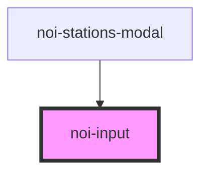

# noi-input

<!-- Auto Generated Below -->

## Properties

| Property       | Attribute      | Description                                                                                                                                                                                                                                                                                                                                                                                                                                                                                                                                                                                      | Type                                                                      | Default        |
| -------------- | -------------- | ------------------------------------------------------------------------------------------------------------------------------------------------------------------------------------------------------------------------------------------------------------------------------------------------------------------------------------------------------------------------------------------------------------------------------------------------------------------------------------------------------------------------------------------------------------------------------------------------ | ------------------------------------------------------------------------- | -------------- |
| `autofocus`    | `autofocus`    | This Boolean attribute lets you specify that a form control should have input focus when the page loads.                                                                                                                                                                                                                                                                                                                                                                                                                                                                                         | `boolean`                                                                 | `false`        |
| `clearInput`   | `clear-input`  | If `true`, a clear icon will appear in the input when there is a value. Clicking it clears the input.                                                                                                                                                                                                                                                                                                                                                                                                                                                                                            | `boolean`                                                                 | `false`        |
| `debounce`     | `debounce`     | Set the amount of time, in milliseconds, to wait to trigger the `noiChange` event after each keystroke.                                                                                                                                                                                                                                                                                                                                                                                                                                                                                          | `number`                                                                  | `0`            |
| `disabled`     | `disabled`     | If `true`, the user cannot interact with the input.                                                                                                                                                                                                                                                                                                                                                                                                                                                                                                                                              | `boolean`                                                                 | `false`        |
| `enterkeyhint` | `enterkeyhint` | A hint to the browser for which enter key to display. Possible values: `"enter"`, `"done"`, `"go"`, `"next"`, `"previous"`, `"search"`, and `"send"`.                                                                                                                                                                                                                                                                                                                                                                                                                                            | `"done" \| "enter" \| "go" \| "next" \| "previous" \| "search" \| "send"` | `undefined`    |
| `inputmode`    | `inputmode`    | A hint to the browser for which keyboard to display. Possible values: `"none"`, `"text"`, `"tel"`, `"url"`, `"email"`, `"numeric"`, `"decimal"`, and `"search"`.                                                                                                                                                                                                                                                                                                                                                                                                                                 | `"none" \| "search" \| "text"`                                            | `undefined`    |
| `max`          | `max`          | The maximum value, which must not be less than its minimum (min attribute) value.                                                                                                                                                                                                                                                                                                                                                                                                                                                                                                                | `string`                                                                  | `undefined`    |
| `maxlength`    | `maxlength`    | If the value of the type attribute is `text`, `email`, `search`, `password`, `tel`, or `url`, this attribute specifies the maximum number of characters that the user can enter.                                                                                                                                                                                                                                                                                                                                                                                                                 | `number`                                                                  | `undefined`    |
| `min`          | `min`          | The minimum value, which must not be greater than its maximum (max attribute) value.                                                                                                                                                                                                                                                                                                                                                                                                                                                                                                             | `string`                                                                  | `undefined`    |
| `minlength`    | `minlength`    | If the value of the type attribute is `text`, `email`, `search`, `password`, `tel`, or `url`, this attribute specifies the minimum number of characters that the user can enter.                                                                                                                                                                                                                                                                                                                                                                                                                 | `number`                                                                  | `undefined`    |
| `multiple`     | `multiple`     | If `true`, the user can enter more than one value. This attribute applies when the type attribute is set to `"email"` or `"file"`, otherwise it is ignored.                                                                                                                                                                                                                                                                                                                                                                                                                                      | `boolean`                                                                 | `undefined`    |
| `name`         | `name`         | The name of the control, which is submitted with the form data.                                                                                                                                                                                                                                                                                                                                                                                                                                                                                                                                  | `string`                                                                  | `this.inputId` |
| `pattern`      | `pattern`      | A regular expression that the value is checked against. The pattern must match the entire value, not just some subset. Use the title attribute to describe the pattern to help the user. This attribute applies when the value of the type attribute is `"text"`, `"search"`, `"tel"`, `"url"`, `"email"`, `"date"`, or `"password"`, otherwise it is ignored. When the type attribute is `"date"`, `pattern` will only be used in browsers that do not support the `"date"` input type natively. See https://developer.mozilla.org/en-US/docs/Web/HTML/Element/input/date for more information. | `string`                                                                  | `undefined`    |
| `placeholder`  | `placeholder`  | Instructional text that shows before the input has a value.                                                                                                                                                                                                                                                                                                                                                                                                                                                                                                                                      | `string`                                                                  | `undefined`    |
| `readonly`     | `readonly`     | If `true`, the user cannot modify the value.                                                                                                                                                                                                                                                                                                                                                                                                                                                                                                                                                     | `boolean`                                                                 | `false`        |
| `required`     | `required`     | If `true`, the user must fill in a value before submitting a form.                                                                                                                                                                                                                                                                                                                                                                                                                                                                                                                               | `boolean`                                                                 | `false`        |
| `size`         | `size`         | The initial size of the control. This value is in pixels unless the value of the type attribute is `"text"` or `"password"`, in which case it is an integer number of characters. This attribute applies only when the `type` attribute is set to `"text"`, `"search"`, `"tel"`, `"url"`, `"email"`, or `"password"`, otherwise it is ignored.                                                                                                                                                                                                                                                   | `number`                                                                  | `undefined`    |
| `step`         | `step`         | Works with the min and max attributes to limit the increments at which a value can be set. Possible values are: `"any"` or a positive floating point number.                                                                                                                                                                                                                                                                                                                                                                                                                                     | `string`                                                                  | `undefined`    |
| `type`         | `type`         | The type of control to display. The default type is text.                                                                                                                                                                                                                                                                                                                                                                                                                                                                                                                                        | `"search" \| "text"`                                                      | `'text'`       |
| `value`        | `value`        | The value of the input.                                                                                                                                                                                                                                                                                                                                                                                                                                                                                                                                                                          | `number \| string`                                                        | `''`           |

## Events

| Event       | Description                             | Type                                  |
| ----------- | --------------------------------------- | ------------------------------------- |
| `noiBlur`   | Emitted when the input loses focus.     | `CustomEvent<FocusEvent>`             |
| `noiChange` | Emitted when the value has changed.     | `CustomEvent<InputChangeEventDetail>` |
| `noiFocus`  | Emitted when the input has focus.       | `CustomEvent<FocusEvent>`             |
| `noiInput`  | Emitted when a keyboard input occurred. | `CustomEvent<KeyboardEvent>`          |

## Methods

### `getInputElement() => Promise<HTMLInputElement>`

Returns the native `<input>` element used under the hood.

#### Returns

Type: `Promise<HTMLInputElement>`

### `setFocus() => Promise<void>`

Sets focus on the native `input` in `ion-input`. Use this method instead of the global
`input.focus()`.

#### Returns

Type: `Promise<void>`

## CSS Custom Properties

| Name                        | Description                                                                                              |
| --------------------------- | -------------------------------------------------------------------------------------------------------- |
| `--background`              | Background of the input                                                                                  |
| `--color`                   | Color of the input text                                                                                  |
| `--padding-bottom`          | Bottom padding of the input                                                                              |
| `--padding-end`             | Right padding if direction is left-to-right, and left padding if direction is right-to-left of the input |
| `--padding-start`           | Left padding if direction is left-to-right, and right padding if direction is right-to-left of the input |
| `--padding-top`             | Top padding of the input                                                                                 |
| `--placeholder-color`       | Color of the input placeholder text                                                                      |
| `--placeholder-font-style`  | Font style of the input placeholder text                                                                 |
| `--placeholder-font-weight` | Font weight of the input placeholder text                                                                |
| `--placeholder-opacity`     | Opacity of the input placeholder text                                                                    |

## Dependencies

### Used by

 - [noi-stations-modal](../../blocks/stations-modal)

### Graph

----------------------------------------------

*Built with [StencilJS](https://stenciljs.com/)*
