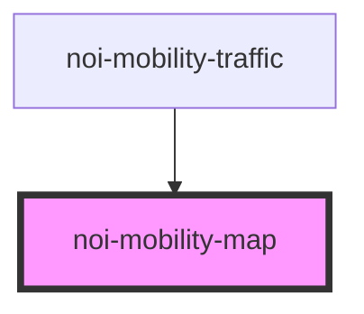

# noi-mobility-map

<!-- Auto Generated Below -->

## Properties

| Property            | Attribute             | Description | Type      | Default                                                |
| ------------------- | --------------------- | ----------- | --------- | ------------------------------------------------------ |
| `defaultPopup`      | `default-popup`       |             | `string`  | `undefined`                                            |
| `iconHeight`        | `icon-height`         |             | `number`  | `32`                                                   |
| `iconUrl`           | `icon-url`            |             | `string`  | `''`                                                   |
| `iconWidth`         | `icon-width`          |             | `number`  | `32`                                                   |
| `latitude`          | `latitude`            |             | `number`  | `51.505`                                               |
| `longitude`         | `longitude`           |             | `number`  | `-0.09`                                                |
| `scale`             | `scale`               |             | `number`  | `13`                                                   |
| `showDefaultMarker` | `show-default-marker` |             | `boolean` | `undefined`                                            |
| `showScale`         | `show-scale`          |             | `boolean` | `undefined`                                            |
| `tileLayer`         | `tile-layer`          |             | `string`  | `'https://{s}.tile.openstreetmap.org/{z}/{x}/{y}.png'` |
| `userIconHeight`    | `user-icon-height`    |             | `number`  | `0`                                                    |
| `userIconUrl`       | `user-icon-url`       |             | `string`  | `''`                                                   |
| `userIconWidth`     | `user-icon-width`     |             | `number`  | `0`                                                    |
| `userLatitude`      | `user-latitude`       |             | `number`  | `0`                                                    |
| `userLongitude`     | `user-longitude`      |             | `number`  | `0`                                                    |

## Dependencies

### Used by

 - [noi-mobility-traffic](../noi-mobility-traffic)

### Graph

----------------------------------------------

*Built with [StencilJS](https://stenciljs.com/)*
