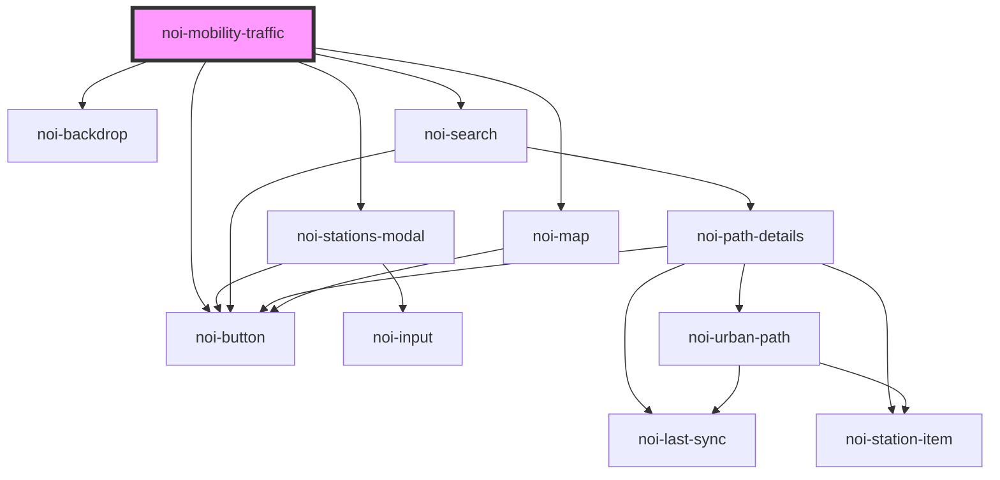

# noi-mobility-traffic

<!-- Auto Generated Below -->

## Dependencies

### Depends on

- [noi-button](./components/button)
- [noi-backdrop](./components/backdrop)
- [noi-stations-modal](./blocks/stations-modal)
- [noi-search](./blocks/search)
- [noi-map](./blocks/map)

### Graph

----------------------------------------------

*Built with [StencilJS](https://stenciljs.com/)*
